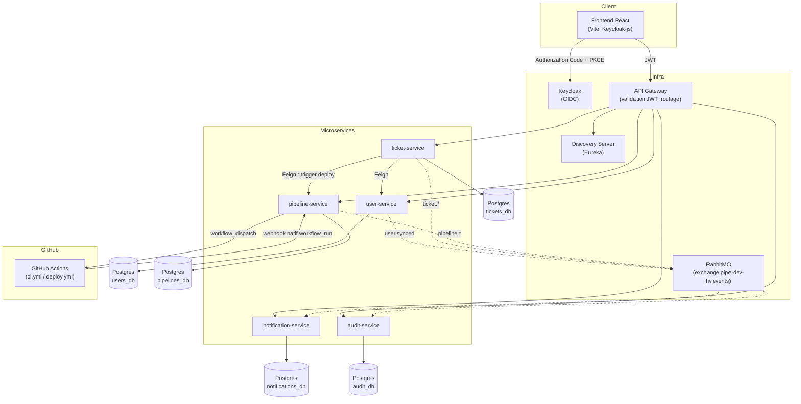

# pipe-dev-liv

Plateforme de ticketing qui pilote un vrai pipeline CI/CD : un ticket suit un cycle de vie complet
(brouillon → soumission → approbation → déploiement DEV/TEST/PROD → clôture), et chaque
approbation déclenche réellement un run GitHub Actions dont le statut revient mettre à jour le
ticket, en temps réel, via notifications et un journal d'audit. Architecture microservices Spring
Boot/Spring Cloud, frontend React, authentification Keycloak.

---

## Architecture



Chaque flèche en pointillé est un événement RabbitMQ asynchrone (routing keys `user.synced`,
`ticket.created`, `ticket.status-changed`, `ticket.approved`, `pipeline.started`,
`pipeline.completed`, `pipeline.failed`) ; `notification-service` et `audit-service` déclarent
chacun leur propre queue et leurs propres DTO miroirs (voir [ADR-0002](docs/adr/0002-rabbitmq-mirror-dto-pattern.md)).

---

## Stack technique

| Couche | Techno |
|---|---|
| Backend | Java 17, Spring Boot 3.3.2, Spring Cloud 2023.0.3 (Eureka, Gateway, OpenFeign) |
| Frontend | React 19, Vite, React Router, TanStack Query, Keycloak-js, Framer Motion, Recharts |
| Auth | Keycloak (OIDC, Authorization Code + PKCE) |
| Messagerie | RabbitMQ (topic exchange, un consommateur = une queue + ses propres DTO) |
| Base de données | PostgreSQL — une instance dédiée par microservice |
| CI/CD | GitHub Actions (runner self-hosted), SonarQube, Trivy, OWASP Dependency-Check |
| Tests | JUnit 5 + Mockito (unitaire), Testcontainers + Failsafe (intégration), Vitest + Testing Library (frontend) |
| Observabilité | Zipkin (tracing), Actuator |

---

## Démarrage local

Prérequis : Docker Desktop, JDK 17, Node 20+.

```bash
# 1. Infrastructure (Postgres x5, Keycloak, RabbitMQ, SonarQube, Zipkin)
docker compose up -d postgres-users postgres-tickets postgres-pipelines postgres-notifications postgres-audit postgres-keycloak keycloak rabbitmq

# 2. discovery-server et api-gateway tournent hors Docker dans ce projet (deux terminaux)
cd backend && ./mvnw.cmd -pl discovery-server spring-boot:run
cd backend && ./mvnw.cmd -pl api-gateway spring-boot:run

# 3. user-service (également hors Docker, voir explication_phase_9.md pour le pourquoi)
cd backend && ./mvnw.cmd -pl user-service spring-boot:run

# 4. Les 4 autres microservices (Docker)
docker compose up -d ticket-service pipeline-service notification-service audit-service

# 5. Frontend
cd frontend && npm install && npm run dev   # http://localhost:5173
```

Puis : ouvrir `http://localhost:5173`, cliquer sur « Se connecter » (redirige vers la vraie page
de login Keycloak), et se connecter avec un utilisateur du realm `pipe-dev-liv`.

Marche à suivre complète (vérification de santé de chaque service, réinitialisation de mot de
passe Keycloak, etc.) : [explication_phase_8.md §8](explication_phase_8.md#8-comment-démarrer-et-ouvrir-lapplication-en-local).

### Lancer les tests

```bash
# Backend — unitaires (Surefire) + intégration (Failsafe, Testcontainers, nécessite Docker)
cd backend && ./mvnw clean verify -pl common-lib,user-service,ticket-service,pipeline-service,notification-service,audit-service

# Frontend
cd frontend && npm run test && npm run lint && npm run build
```

---

## CI/CD

`.github/workflows/ci.yml` construit/teste chaque module modifié (filtrage par chemin), lance
l'analyse SonarQube et des scans de sécurité (Trivy, OWASP Dependency-Check, non bloquants).
`.github/workflows/deploy.yml` est le workflow réellement déclenché par `pipeline-service`
lorsqu'un ticket est approuvé — son statut de complétion revient via le webhook natif GitHub
`workflow_run`, pas un endpoint personnalisé. Les deux tournent sur un runner self-hosted (accès
direct à SonarQube et au reste de la stack locale).

**Pour rejouer le pipeline sur votre propre machine**, il faut d'abord configurer le runner
(variables `STACK_DIR`/`DOCKER_HOST`, secret SonarQube, webhook ngrok) :
[docs/runner-setup.md](docs/runner-setup.md).

Contexte et décisions de conception : [explication_phase_9.md](explication_phase_9.md).

---

## Documentation

Chaque phase de construction a son propre document détaillé (contexte, décisions, ce qui reste
ouvert) :

- [Phase 0 — Bootstrap](explication_phase_0.md)
- [Phase 1](explication_phase_1.md)
- [Phase 2 — Sécurité / Keycloak](explication_phase_2.md) · [durcissement](explication_phase_2_durcissement_securite.md)
- [Phase 4 — Ticket Service](explication_phase_4.md)
- [Phase 5 — Pipeline Service](explication_phase_5.md)
- [Phase 6 — Notification Service](explication_phase_6.md)
- [Phase 7 — Audit Service](explication_phase_7.md)
- [Phase 8 — Frontend](explication_phase_8.md)
- [Phase 9 — CI/CD](explication_phase_9.md)
- [Phase 10 — Tests & Documentation](explication_phase_10.md)

Décisions d'architecture non-évidentes, indépendamment de la chronologie des phases :
[`docs/adr/`](docs/adr/).

Journal de bord complet : [`progress.md`](progress.md).
