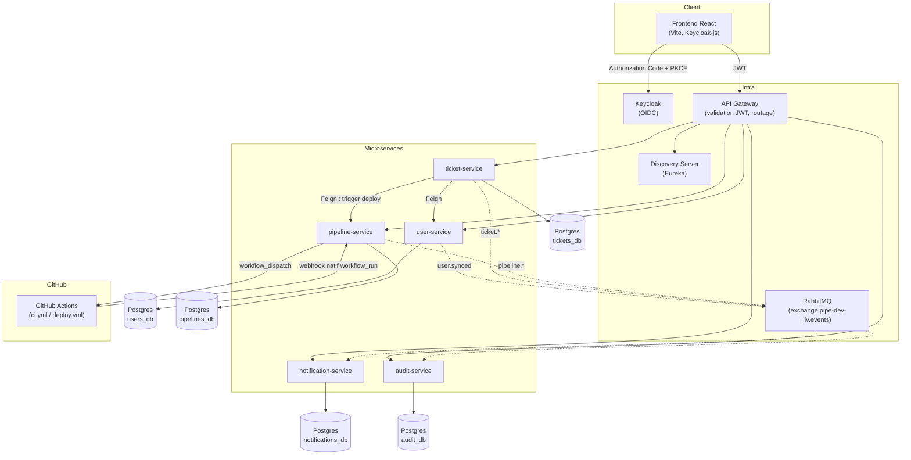

# pipe-dev-liv

Plateforme de ticketing qui pilote un vrai pipeline CI/CD : un ticket suit un cycle de vie complet
(brouillon → soumission → approbation → déploiement DEV/TEST/PROD → clôture), et chaque
approbation déclenche réellement un run GitHub Actions dont le statut revient mettre à jour le
ticket, en temps réel, via notifications et un journal d'audit. Architecture microservices Spring
Boot/Spring Cloud, frontend React, authentification Keycloak.

---

## Architecture



Chaque flèche en pointillé est un événement RabbitMQ asynchrone (routing keys `user.synced`,
`ticket.created`, `ticket.status-changed`, `ticket.approved`, `pipeline.started`,
`pipeline.completed`, `pipeline.failed`) ; `notification-service` et `audit-service` déclarent
chacun leur propre queue et leurs propres DTO miroirs (voir [ADR-0002](docs/adr/0002-rabbitmq-mirror-dto-pattern.md)).

---

## Stack technique

| Couche | Techno |
|---|---|
| Backend | Java 17, Spring Boot 3.3.2, Spring Cloud 2023.0.3 (Eureka, Gateway, OpenFeign) |
| Frontend | React 19, Vite, React Router, TanStack Query, Keycloak-js, Framer Motion, Recharts |
| Auth | Keycloak (OIDC, Authorization Code + PKCE) |
| Messagerie | RabbitMQ (topic exchange, un consommateur = une queue + ses propres DTO) |
| Base de données | PostgreSQL — une instance dédiée par microservice |
| CI/CD | GitHub Actions (runner self-hosted), SonarQube, Trivy, OWASP Dependency-Check |
| Tests | JUnit 5 + Mockito (unitaire), Testcontainers + Failsafe (intégration), Vitest + Testing Library (frontend) |
| Observabilité | Zipkin (tracing), Actuator |

---

## Démarrage local

Prérequis : Docker Desktop, JDK 17, Node 20+.

Créer `.env` à partir de `.env.example` et renseigner les valeurs `CHANGE_ME`. `EUREKA_INSTANCE_HOSTNAME`
doit valoir l'IP LAN de la machine ; comme elle est attribuée par DHCP et change, l'aligner avec :

```powershell
.\scripts\sync-lan-ip.ps1
```

Si l'application devient très lente et n'affiche plus rien, c'est le premier réflexe : les
conteneurs s'annoncent alors auprès d'Eureka à une adresse qui n'est plus celle de la machine.

```bash
# 1. Infrastructure (Postgres x5, Keycloak, RabbitMQ, SonarQube, Zipkin)
docker compose up -d postgres-users postgres-tickets postgres-pipelines postgres-notifications postgres-audit postgres-keycloak keycloak rabbitmq

# 2. discovery-server et api-gateway tournent hors Docker dans ce projet (deux terminaux)
cd backend && ./mvnw.cmd -pl discovery-server spring-boot:run
cd backend && ./mvnw.cmd -pl api-gateway spring-boot:run

# 3. Les 5 microservices métier (Docker)
docker compose up -d user-service ticket-service pipeline-service notification-service audit-service

# 4. Frontend
cd frontend && npm install && npm run dev   # http://localhost:5173
```

> ⚠️ **Ne lancez pas ces 5 services en natif.** Seuls `discovery-server` et `api-gateway` tournent
> hors Docker ([ADR-0001](docs/adr/0001-microservices-spring-cloud.md), [ADR-0006](docs/adr/0006-no-per-environment-compose-split.md)) ;
> les 5 autres sont conteneurisés. Une instance native occupe le port du conteneur correspondant
> (8081→8085), et `deploy.yml` échouera au déploiement suivant sur
> `ports are not available: ... bind`. Pour déboguer un service dans l'IDE, arrêtez d'abord son
> conteneur : `docker compose stop ticket-service`.

Puis : ouvrir `http://localhost:5173`, cliquer sur « Se connecter » (redirige vers la vraie page
de login Keycloak), et se connecter avec un utilisateur du realm `pipe-dev-liv`.

Vérifier que tout répond :

```bash
curl http://localhost:8761                     # discovery-server
curl http://localhost:8080/actuator/health     # api-gateway
curl http://localhost:8081/actuator/health     # user-service
curl http://localhost:8082/actuator/health     # ticket-service
curl http://localhost:8083/actuator/health     # pipeline-service
curl http://localhost:8084/actuator/health     # notification-service
curl http://localhost:8085/actuator/health     # audit-service
```

### Lancer les tests

```bash
# Backend — unitaires (Surefire) + intégration (Failsafe, Testcontainers, nécessite Docker)
cd backend && ./mvnw clean verify -pl common-lib,user-service,ticket-service,pipeline-service,notification-service,audit-service

# Frontend
cd frontend && npm run test && npm run lint && npm run build
```

---

## CI/CD

`.github/workflows/ci.yml` construit/teste chaque module modifié (filtrage par chemin), lance
l'analyse SonarQube et des scans de sécurité (Trivy, OWASP Dependency-Check, non bloquants).
`.github/workflows/deploy.yml` est le workflow réellement déclenché par `pipeline-service`
lorsqu'un ticket est approuvé — son statut de complétion revient via le webhook natif GitHub
`workflow_run`, pas un endpoint personnalisé. Les deux tournent sur un runner self-hosted (accès
direct à SonarQube et au reste de la stack locale).

**Pour rejouer le pipeline sur votre propre machine**, il faut d'abord configurer le runner
(variables `STACK_DIR`/`DOCKER_HOST`, secret SonarQube, webhook ngrok) :
[docs/runner-setup.md](docs/runner-setup.md).

Contexte et décisions de conception :
[ADR-0004](docs/adr/0004-native-github-webhook-over-custom-endpoint.md) (webhook natif plutôt
qu'un endpoint maison) et
[ADR-0005](docs/adr/0005-self-hosted-runner-and-webhook-forwarding.md) (runner self-hosted).

---

## Documentation

- [`docs/adr/`](docs/adr/) — décisions d'architecture non-évidentes et leurs alternatives
  écartées. C'est la référence à consulter en premier : chaque ADR explique *pourquoi* une
  chose est faite ainsi, pas seulement comment.
- [`docs/runner-setup.md`](docs/runner-setup.md) — tout ce qui doit être configuré **par
  machine** pour faire tourner le pipeline : runner, variables d'environnement, webhook,
  SonarQube, et un tableau de dépannage des pannes déjà rencontrées.
- [`progress.md`](progress.md) — journal de bord chronologique de la construction.
