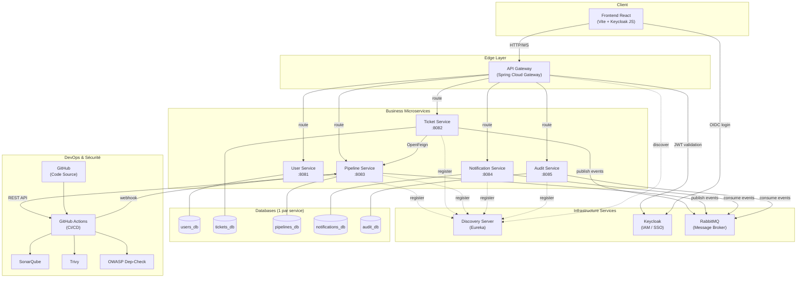
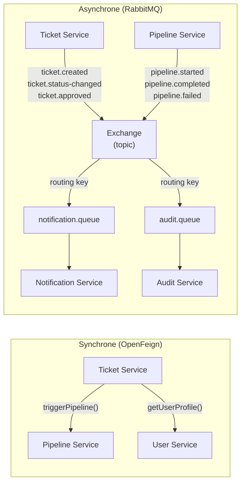
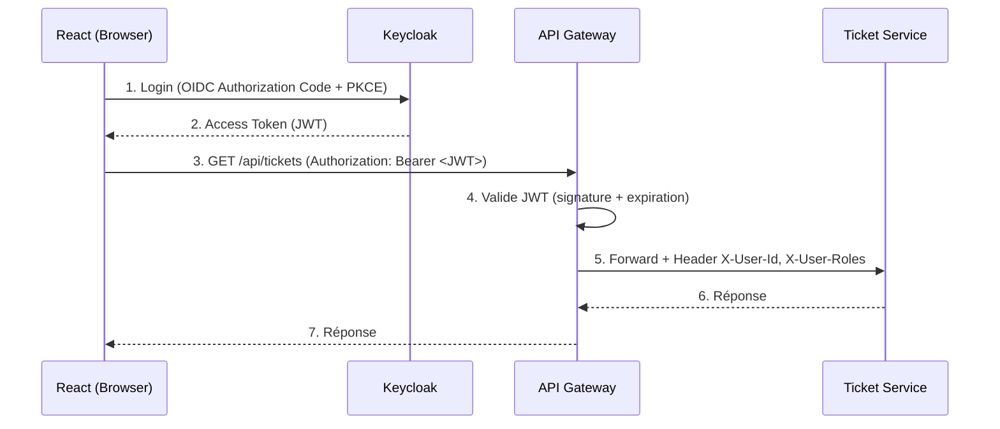
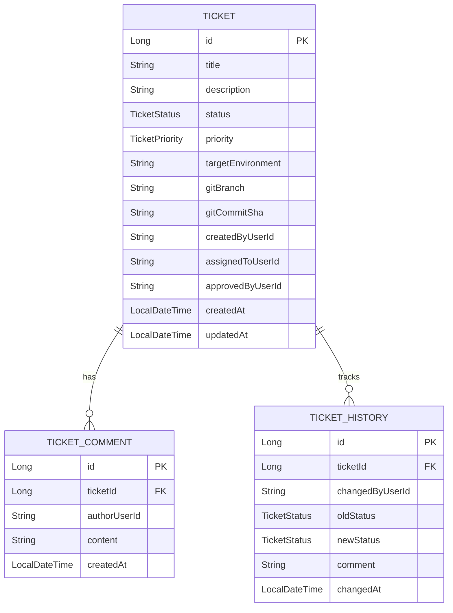
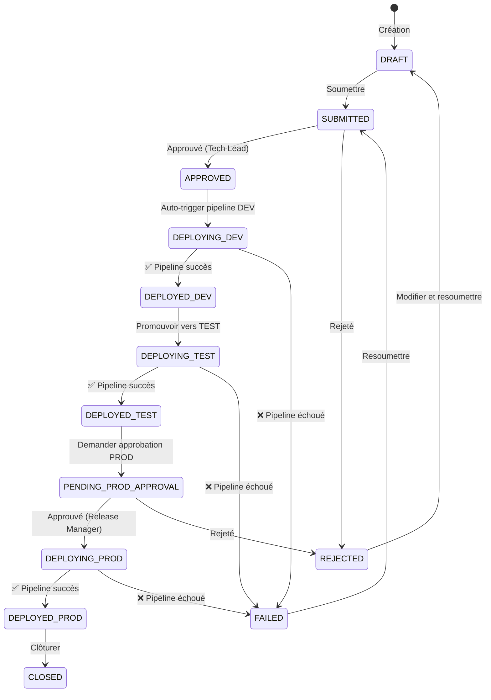
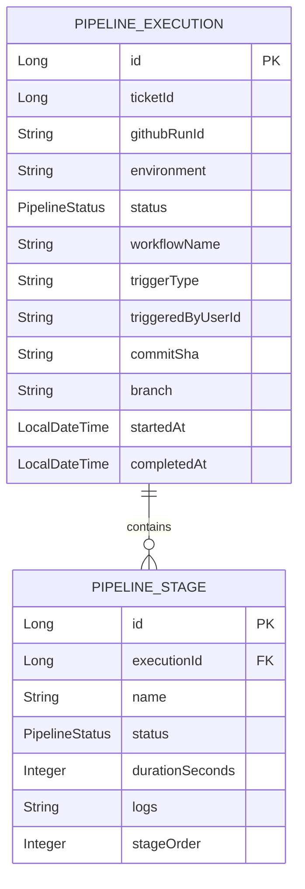
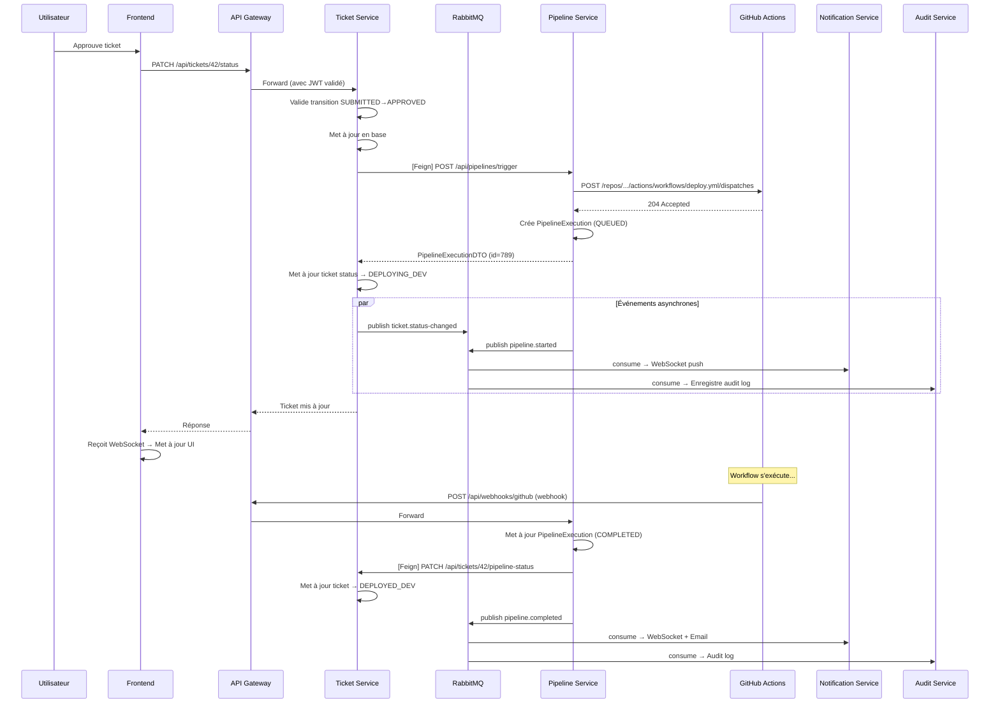

# Pipeline DevOps CI/CD — Architecture Microservices

## Contexte du Projet

**Sujet** : Mise en place d'un pipeline DevOps CI/CD sur les environnements DEV, TEST et PROD, intégrant des contrôles de sécurité, des tests automatisés, et une application de ticketing qui pilote le pipeline.

**Changement** : Passage d'une architecture monolithique modulaire vers une **architecture microservices** avec Spring Cloud, RabbitMQ, et un API Gateway.

> [!WARNING]
> **Mot de passe en clair dans** [application.properties](file:///g:/projetc/backend/src/main/resources/application.properties) — Sera résolu en Phase 0 avec la gestion des variables d'environnement et les profils Spring.

---

## Architecture Globale Microservices



---

## Patterns Microservices Utilisés

| Pattern | Implémentation | Pourquoi |
|---------|----------------|----------|
| **API Gateway** | Spring Cloud Gateway | Point d'entrée unique, routage, sécurité centralisée |
| **Service Discovery** | Netflix Eureka | Découverte dynamique des services |
| **Database per Service** | PostgreSQL x5 | Indépendance des données, déploiement indépendant |
| **Event-Driven** | RabbitMQ (AMQP) | Couplage faible inter-services, communication asynchrone |
| **Synchronous Call** | OpenFeign Client | Appels REST entre services quand réponse immédiate nécessaire |
| **Circuit Breaker** | Resilience4j | Tolérance aux pannes, fallback en cas d'indisponibilité |
| **Centralized Config** | Variables d'env + profils Spring | Configuration par environnement |
| **Distributed Tracing** | Micrometer + Zipkin (optionnel) | Traçabilité des requêtes à travers les services |

---

## Communication Inter-Services



**Règle de communication** :
- **Synchrone (Feign)** → Quand le service appelant a **besoin de la réponse** pour continuer (ex : déclencher un pipeline et récupérer l'ID d'exécution)
- **Asynchrone (RabbitMQ)** → Quand c'est un **événement informatif** que d'autres services consomment à leur rythme (ex : notifier, auditer)

---

## Vue d'ensemble des Phases

| Phase | Titre | Durée Estimée | Description |
|-------|-------|---------------|-------------|
| **0** | Infrastructure Docker Compose | 3-4 jours | Tous les services infra + bases de données |
| **1** | Structure Projet + Services Infra | 4-5 jours | Maven multi-modules, Eureka, Gateway |
| **2** | Sécurité Centralisée (Keycloak) | 3-4 jours | JWT, RBAC, propagation tokens |
| **3** | User Service | 2-3 jours | Profils, synchronisation Keycloak |
| **4** | Ticket Service (Cœur Métier) | 5-7 jours | CRUD, machine d'état, événements |
| **5** | Pipeline Service | 5-6 jours | GitHub Actions API, webhooks |
| **6** | Notification Service | 3-4 jours | WebSocket, Email, consommateur RabbitMQ |
| **7** | Audit Service | 2-3 jours | Traçabilité, logs, rapports |
| **8** | Frontend React | 7-8 jours | Dashboard, pages, temps réel |
| **9** | Pipelines CI/CD (GitHub Actions) | 5-6 jours | Workflows multi-service, sécurité |
| **10** | Tests + Documentation | 5-6 jours | Tests par service, rapport de stage |

---

## PHASE 0 — Infrastructure Docker Compose

### Étape 0.1 : Docker Compose Principal

#### [NEW] docker-compose.yml

```yaml
services:
  # ===================== DATABASES =====================
  postgres-users:
    image: postgres:16-alpine
    environment:
      POSTGRES_DB: users_db
      POSTGRES_USER: ${DB_USER}
      POSTGRES_PASSWORD: ${DB_PASSWORD}
    ports: ["5433:5432"]
    volumes: [postgres_users:/var/lib/postgresql/data]

  postgres-tickets:
    image: postgres:16-alpine
    environment:
      POSTGRES_DB: tickets_db
      POSTGRES_USER: ${DB_USER}
      POSTGRES_PASSWORD: ${DB_PASSWORD}
    ports: ["5434:5432"]
    volumes: [postgres_tickets:/var/lib/postgresql/data]

  postgres-pipelines:
    image: postgres:16-alpine
    environment:
      POSTGRES_DB: pipelines_db
      POSTGRES_USER: ${DB_USER}
      POSTGRES_PASSWORD: ${DB_PASSWORD}
    ports: ["5435:5432"]
    volumes: [postgres_pipelines:/var/lib/postgresql/data]

  postgres-notifications:
    image: postgres:16-alpine
    environment:
      POSTGRES_DB: notifications_db
      POSTGRES_USER: ${DB_USER}
      POSTGRES_PASSWORD: ${DB_PASSWORD}
    ports: ["5436:5432"]
    volumes: [postgres_notifications:/var/lib/postgresql/data]

  postgres-audit:
    image: postgres:16-alpine
    environment:
      POSTGRES_DB: audit_db
      POSTGRES_USER: ${DB_USER}
      POSTGRES_PASSWORD: ${DB_PASSWORD}
    ports: ["5437:5432"]
    volumes: [postgres_audit:/var/lib/postgresql/data]

  postgres-keycloak:
    image: postgres:16-alpine
    environment:
      POSTGRES_DB: keycloak
      POSTGRES_USER: ${KC_DB_USER}
      POSTGRES_PASSWORD: ${KC_DB_PASSWORD}
    volumes: [postgres_keycloak:/var/lib/postgresql/data]

  # ===================== MESSAGE BROKER =====================
  rabbitmq:
    image: rabbitmq:4-management-alpine
    environment:
      RABBITMQ_DEFAULT_USER: ${RABBIT_USER}
      RABBITMQ_DEFAULT_PASS: ${RABBIT_PASSWORD}
    ports:
      - "5672:5672"     # AMQP
      - "15672:15672"   # Management UI
    volumes: [rabbitmq_data:/var/lib/rabbitmq]

  # ===================== KEYCLOAK =====================
  keycloak:
    image: quay.io/keycloak/keycloak:26.2
    command: start-dev
    environment:
      KC_DB: postgres
      KC_DB_URL: jdbc:postgresql://postgres-keycloak:5432/keycloak
      KC_DB_USERNAME: ${KC_DB_USER}
      KC_DB_PASSWORD: ${KC_DB_PASSWORD}
      KC_HOSTNAME: localhost
      KC_HTTP_PORT: 9090
      KEYCLOAK_ADMIN: ${KC_ADMIN_USER}
      KEYCLOAK_ADMIN_PASSWORD: ${KC_ADMIN_PASSWORD}
    ports: ["9090:9090"]
    depends_on: [postgres-keycloak]

  # ===================== SONARQUBE =====================
  postgres-sonar:
    image: postgres:16-alpine
    environment:
      POSTGRES_DB: sonar
      POSTGRES_USER: ${SONAR_DB_USER}
      POSTGRES_PASSWORD: ${SONAR_DB_PASSWORD}
    volumes: [postgres_sonar:/var/lib/postgresql/data]

  sonarqube:
    image: sonarqube:lts-community
    environment:
      SONAR_JDBC_URL: jdbc:postgresql://postgres-sonar:5432/sonar
      SONAR_JDBC_USERNAME: ${SONAR_DB_USER}
      SONAR_JDBC_PASSWORD: ${SONAR_DB_PASSWORD}
    ports: ["9000:9000"]
    depends_on: [postgres-sonar]

  # ===================== ZIPKIN (Tracing Optionnel) =====================
  zipkin:
    image: openzipkin/zipkin:latest
    ports: ["9411:9411"]

volumes:
  postgres_users:
  postgres_tickets:
  postgres_pipelines:
  postgres_notifications:
  postgres_audit:
  postgres_keycloak:
  postgres_sonar:
  rabbitmq_data:
```

### Étape 0.2 : Variables d'Environnement

#### [NEW] .env (local, dans .gitignore)
```env
# === Databases ===
DB_USER=postgres
DB_PASSWORD=your_secure_password

# === RabbitMQ ===
RABBIT_USER=guest
RABBIT_PASSWORD=guest_secure_password
RABBIT_HOST=localhost
RABBIT_PORT=5672

# === Keycloak ===
KC_ADMIN_USER=admin
KC_ADMIN_PASSWORD=admin_secure_password
KC_DB_USER=keycloak
KC_DB_PASSWORD=keycloak_secure_password
KC_REALM=pipe-dev-liv
KC_CLIENT_ID=ticketing-app
KC_AUTH_SERVER_URL=http://localhost:9090

# === SonarQube ===
SONAR_DB_USER=sonar
SONAR_DB_PASSWORD=sonar_secure_password
SONAR_TOKEN=your_sonar_token

# === GitHub ===
GITHUB_TOKEN=ghp_xxxxx
GITHUB_OWNER=your-username
GITHUB_REPO=pipe-dev-liv
GITHUB_WEBHOOK_SECRET=your_webhook_secret

# === Eureka ===
EUREKA_HOST=localhost
EUREKA_PORT=8761

# === Application ===
SPRING_PROFILES_ACTIVE=dev
```

#### [NEW] .env.example (committé — sans valeurs sensibles)

### Étape 0.3 : Configuration GitHub

1. **3 GitHub Environments** : `development`, `testing`, `production` (PROD avec approbation manuelle)
2. **Secrets GitHub** par environnement
3. **Stratégie de branches** :
   ```
   main          → PROD (tags/releases)
   develop       → DEV (push continu)
   release/*     → TEST
   feature/*     → Développement
   hotfix/*      → Corrections urgentes
   ```
4. **Branch Protection Rules** sur `main` et `develop`

---

## PHASE 1 — Structure Projet Multi-Modules + Services Infra

### Étape 1.1 : Structure Maven Multi-Modules

Transformer le projet en structure multi-modules avec un POM parent :

```
g:\projetc\
├── docker-compose.yml
├── .env / .env.example
├── .github/
│   └── workflows/
│       ├── ci.yml
│       └── deploy.yml
├── frontend/                          ← React (Vite)
│   ├── Dockerfile
│   ├── nginx.conf
│   └── src/
│
├── pom.xml                            ← POM Parent (Maven multi-modules)
│
├── common-lib/                        ← Bibliothèque partagée
│   ├── pom.xml
│   └── src/main/java/.../common/
│       ├── dto/
│       │   ├── ApiResponse.java
│       │   └── PageResponse.java
│       ├── event/                     ← DTOs des événements RabbitMQ
│       │   ├── TicketEvent.java
│       │   ├── PipelineEvent.java
│       │   └── EventType.java
│       ├── exception/
│       │   ├── ResourceNotFoundException.java
│       │   └── BusinessException.java
│       └── security/
│           └── JwtUtils.java
│
├── discovery-server/                  ← Eureka Server
│   ├── pom.xml
│   ├── Dockerfile
│   └── src/
│
├── api-gateway/                       ← Spring Cloud Gateway
│   ├── pom.xml
│   ├── Dockerfile
│   └── src/
│
├── user-service/                      ← Microservice Utilisateurs
│   ├── pom.xml
│   ├── Dockerfile
│   └── src/
│
├── ticket-service/                    ← Microservice Ticketing
│   ├── pom.xml
│   ├── Dockerfile
│   └── src/
│
├── pipeline-service/                  ← Microservice Pipeline
│   ├── pom.xml
│   ├── Dockerfile
│   └── src/
│
├── notification-service/              ← Microservice Notifications
│   ├── pom.xml
│   ├── Dockerfile
│   └── src/
│
└── audit-service/                     ← Microservice Audit
    ├── pom.xml
    ├── Dockerfile
    └── src/
```

### Étape 1.2 : POM Parent

#### [NEW] pom.xml (racine)

```xml
<project>
    <groupId>com.pipedevliv</groupId>
    <artifactId>pipe-dev-liv</artifactId>
    <version>1.0.0-SNAPSHOT</version>
    <packaging>pom</packaging>

    <parent>
        <groupId>org.springframework.boot</groupId>
        <artifactId>spring-boot-starter-parent</artifactId>
        <version>4.1.0</version>
    </parent>

    <modules>
        <module>common-lib</module>
        <module>discovery-server</module>
        <module>api-gateway</module>
        <module>user-service</module>
        <module>ticket-service</module>
        <module>pipeline-service</module>
        <module>notification-service</module>
        <module>audit-service</module>
    </modules>

    <properties>
        <java.version>17</java.version>
        <spring-cloud.version>2025.0.0</spring-cloud.version>
    </properties>

    <dependencyManagement>
        <dependencies>
            <dependency>
                <groupId>org.springframework.cloud</groupId>
                <artifactId>spring-cloud-dependencies</artifactId>
                <version>${spring-cloud.version}</version>
                <type>pom</type>
                <scope>import</scope>
            </dependency>
        </dependencies>
    </dependencyManagement>
</project>
```

### Étape 1.3 : Common Library

#### [NEW] common-lib/pom.xml

Bibliothèque JAR (pas Spring Boot) contenant :
- DTOs partagés (événements RabbitMQ, réponses API standards)
- Exceptions communes
- Utilitaires JWT
- Configuration RabbitMQ partagée (noms des exchanges, queues, routing keys)

```java
// Constantes RabbitMQ partagées entre tous les services
public final class RabbitMQConstants {
    public static final String EXCHANGE = "pipe-dev-liv.events";

    // Routing keys
    public static final String TICKET_CREATED      = "ticket.created";
    public static final String TICKET_STATUS_CHANGED = "ticket.status-changed";
    public static final String TICKET_APPROVED     = "ticket.approved";
    public static final String PIPELINE_STARTED    = "pipeline.started";
    public static final String PIPELINE_COMPLETED  = "pipeline.completed";
    public static final String PIPELINE_FAILED     = "pipeline.failed";

    // Queues
    public static final String NOTIFICATION_QUEUE  = "notification.queue";
    public static final String AUDIT_QUEUE         = "audit.queue";
    public static final String PIPELINE_QUEUE      = "pipeline.queue";
}
```

### Étape 1.4 : Discovery Server (Eureka)

#### [NEW] discovery-server/

- Dépendance : `spring-cloud-starter-netflix-eureka-server`
- Annotation : `@EnableEurekaServer`
- Port : `8761`
- Dashboard accessible à `http://localhost:8761`

### Étape 1.5 : API Gateway (Spring Cloud Gateway)

#### [NEW] api-gateway/

- Dépendances : `spring-cloud-starter-gateway`, `spring-cloud-starter-netflix-eureka-client`, `spring-boot-starter-oauth2-resource-server`
- Port : `8080` (seul port exposé au frontend)

Configuration du routage :

```yaml
spring:
  cloud:
    gateway:
      routes:
        - id: user-service
          uri: lb://USER-SERVICE
          predicates:
            - Path=/api/users/**

        - id: ticket-service
          uri: lb://TICKET-SERVICE
          predicates:
            - Path=/api/tickets/**

        - id: pipeline-service
          uri: lb://PIPELINE-SERVICE
          predicates:
            - Path=/api/pipelines/**, /api/webhooks/**

        - id: notification-service
          uri: lb://NOTIFICATION-SERVICE
          predicates:
            - Path=/api/notifications/**

        - id: notification-ws
          uri: lb:ws://NOTIFICATION-SERVICE
          predicates:
            - Path=/ws/**

        - id: audit-service
          uri: lb://AUDIT-SERVICE
          predicates:
            - Path=/api/audit/**
```

**Rôle de la Gateway** :
1. **Routage** — Dirige les requêtes vers le bon service via Eureka
2. **Sécurité** — Valide le JWT Keycloak à l'entrée, propage le token en amont
3. **CORS** — Configuration centralisée
4. **Rate Limiting** — Protection contre les abus
5. **Logging** — Log centralisé des requêtes entrantes

---

## PHASE 2 — Sécurité Centralisée (Keycloak)

### Étape 2.1 : Configuration Keycloak

1. **Realm** : `pipe-dev-liv`
2. **Client public** (Frontend SPA) :
   - Client ID : `ticketing-app`
   - Valid Redirect URIs : `http://localhost:5173/*`
   - Web Origins : `http://localhost:5173`
3. **Client confidentiel** (Backend — service account) :
   - Client ID : `ticketing-api`
   - Service Account Enabled : `true`

4. **Rôles Realm** :

| Rôle | Description | Permissions |
|------|-------------|-------------|
| `ROLE_DEVELOPER` | Développeur | Créer tickets, voir ses tickets |
| `ROLE_TECH_LEAD` | Lead technique | Approuver tickets DEV/TEST |
| `ROLE_RELEASE_MANAGER` | Responsable release | Approuver déploiements PROD |
| `ROLE_ADMIN` | Administrateur | Accès complet |
| `ROLE_VIEWER` | Observateur | Lecture seule |

### Étape 2.2 : Sécurité au Niveau de la Gateway



**Stratégie de sécurité** :
- La **Gateway** valide le JWT et extrait les claims (userId, roles)
- Les claims sont passés aux services en aval via des **headers HTTP** (`X-User-Id`, `X-User-Roles`, `X-User-Email`)
- Chaque microservice a un **filtre** qui lit ces headers et crée le contexte de sécurité
- Les services ne re-valident PAS le JWT (la Gateway est le seul point de confiance)

### Étape 2.3 : SecurityConfig par Microservice

Chaque microservice a sa propre `SecurityConfig` qui :
- Lit les headers `X-User-*` injectés par la Gateway
- Applique `@PreAuthorize` pour le contrôle d'accès fin
- **Refuse** les requêtes directes (sans passer par la Gateway) en production

### Étape 2.4 : Matrice de Sécurité Complète

| Couche | Outil | Description |
|--------|-------|-------------|
| **Authentification** | Keycloak (OIDC/JWT) | SSO centralisé, tokens signés |
| **Autorisation** | Spring Security RBAC par service | `@PreAuthorize` par endpoint |
| **API Gateway** | Spring Cloud Gateway | Validation JWT centralisée |
| **Analyse code** | SonarQube | Bugs, code smells, vulnérabilités SAST |
| **Scan images** | Trivy | Vulnérabilités dans les images Docker |
| **Dépendances** | OWASP Dependency-Check | CVE dans les deps Maven/npm |
| **Secrets** | GitHub Secrets + `.env` | Aucun secret en clair dans le code |
| **Communication** | HTTPS (PROD) | Chiffrement en transit |
| **Input Validation** | Bean Validation (`@Valid`) | Protection injections |
| **Rate Limiting** | Gateway Filter | Protection abus |
| **Circuit Breaker** | Resilience4j | Tolérance aux pannes |

---

## PHASE 3 — User Service

### Étape 3.1 : Responsabilités

- Stocker les profils utilisateurs (synchronisés depuis Keycloak)
- Exposer une API REST pour consulter les utilisateurs
- Utilisé par Ticket Service (via Feign) pour résoudre les noms d'utilisateurs

### Étape 3.2 : Structure

```
user-service/src/main/java/com/pipedevliv/user/
├── UserServiceApplication.java
├── config/
│   ├── SecurityConfig.java
│   └── RabbitMQConfig.java
├── entity/
│   └── UserProfile.java
├── repository/
│   └── UserProfileRepository.java
├── service/
│   ├── UserService.java            ← Interface
│   └── UserServiceImpl.java
├── controller/
│   └── UserController.java
└── dto/
    ├── UserDTO.java
    └── UserSyncDTO.java
```

### Étape 3.3 : API REST

| Méthode | Endpoint | Description |
|---------|----------|-------------|
| `GET` | `/api/users` | Lister les utilisateurs (pagination) |
| `GET` | `/api/users/{id}` | Détails d'un utilisateur |
| `GET` | `/api/users/me` | Profil de l'utilisateur connecté |
| `GET` | `/api/users/by-keycloak-id/{kcId}` | Recherche par ID Keycloak |

### Étape 3.4 : Synchronisation Keycloak → User Service

- Au premier login d'un utilisateur, le User Service crée automatiquement un profil local
- Utilise Keycloak Admin REST API pour synchroniser les rôles

---

## PHASE 4 — Ticket Service (Cœur Métier)

### Étape 4.1 : Structure

```
ticket-service/src/main/java/com/pipedevliv/ticket/
├── TicketServiceApplication.java
├── config/
│   ├── SecurityConfig.java
│   ├── RabbitMQConfig.java
│   └── FeignConfig.java
├── entity/
│   ├── Ticket.java
│   ├── TicketStatus.java           ← Enum (14 statuts)
│   ├── TicketPriority.java         ← Enum (LOW, MEDIUM, HIGH, CRITICAL)
│   ├── TicketComment.java
│   └── TicketHistory.java
├── repository/
│   ├── TicketRepository.java
│   ├── TicketCommentRepository.java
│   └── TicketHistoryRepository.java
├── service/
│   ├── TicketService.java          ← Interface
│   ├── TicketServiceImpl.java
│   └── TicketStateMachine.java     ← Validation des transitions
├── controller/
│   └── TicketController.java
├── dto/
│   ├── TicketCreateDTO.java
│   ├── TicketUpdateDTO.java
│   ├── TicketResponseDTO.java
│   └── TicketFilterDTO.java
├── feign/
│   ├── PipelineServiceClient.java  ← Appel synchrone → Pipeline Service
│   └── UserServiceClient.java     ← Appel synchrone → User Service
├── messaging/
│   └── TicketEventPublisher.java   ← Publie sur RabbitMQ
└── mapper/
    └── TicketMapper.java           ← MapStruct
```

### Étape 4.2 : Modèle de Données



### Étape 4.3 : Machine d'État



**Implémentation** : Classe `TicketStateMachine` qui valide chaque transition et vérifie le rôle de l'utilisateur.

```java
public class TicketStateMachine {
    private static final Map<TicketStatus, Set<TicketStatus>> TRANSITIONS = Map.ofEntries(
        entry(DRAFT, Set.of(SUBMITTED)),
        entry(SUBMITTED, Set.of(APPROVED, REJECTED)),
        entry(APPROVED, Set.of(DEPLOYING_DEV)),
        entry(DEPLOYING_DEV, Set.of(DEPLOYED_DEV, FAILED)),
        // ... etc
    );

    public void validateTransition(TicketStatus from, TicketStatus to, String userRole) {
        if (!TRANSITIONS.getOrDefault(from, Set.of()).contains(to)) {
            throw new InvalidTransitionException(from, to);
        }
        // Vérifier que l'utilisateur a le rôle requis pour cette transition
    }
}
```

### Étape 4.4 : Feign Client → Pipeline Service

```java
@FeignClient(name = "PIPELINE-SERVICE", fallback = PipelineServiceFallback.class)
public interface PipelineServiceClient {

    @PostMapping("/api/pipelines/trigger")
    ApiResponse<PipelineExecutionDTO> triggerPipeline(@RequestBody PipelineTriggerDTO request);

    @GetMapping("/api/pipelines/executions/{id}")
    ApiResponse<PipelineExecutionDTO> getExecution(@PathVariable Long id);
}
```

### Étape 4.5 : Publication d'Événements RabbitMQ

```java
@Component
@RequiredArgsConstructor
public class TicketEventPublisher {
    private final RabbitTemplate rabbitTemplate;

    public void publishStatusChanged(Ticket ticket, TicketStatus oldStatus) {
        var event = new TicketEvent(
            EventType.TICKET_STATUS_CHANGED,
            ticket.getId(),
            ticket.getTitle(),
            oldStatus.name(),
            ticket.getStatus().name(),
            ticket.getCreatedByUserId(),
            LocalDateTime.now()
        );
        rabbitTemplate.convertAndSend(
            RabbitMQConstants.EXCHANGE,
            RabbitMQConstants.TICKET_STATUS_CHANGED,
            event
        );
    }
}
```

### Étape 4.6 : API REST

| Méthode | Endpoint | Rôle Requis | Description |
|---------|----------|-------------|-------------|
| `POST` | `/api/tickets` | DEVELOPER+ | Créer un ticket |
| `GET` | `/api/tickets` | VIEWER+ | Lister (pagination, filtres) |
| `GET` | `/api/tickets/{id}` | VIEWER+ | Détails |
| `PUT` | `/api/tickets/{id}` | DEVELOPER+ (owner) | Modifier |
| `PATCH` | `/api/tickets/{id}/status` | TECH_LEAD+ | Changer statut |
| `POST` | `/api/tickets/{id}/approve` | TECH_LEAD / RELEASE_MANAGER | Approuver |
| `POST` | `/api/tickets/{id}/reject` | TECH_LEAD / RELEASE_MANAGER | Rejeter |
| `POST` | `/api/tickets/{id}/deploy/{env}` | TECH_LEAD+ | Déclencher déploiement |
| `GET` | `/api/tickets/{id}/history` | VIEWER+ | Historique |
| `POST` | `/api/tickets/{id}/comments` | DEVELOPER+ | Commenter |
| `GET` | `/api/tickets/stats` | ADMIN | Statistiques |

---

## PHASE 5 — Pipeline Service

### Étape 5.1 : Structure

```
pipeline-service/src/main/java/com/pipedevliv/pipeline/
├── PipelineServiceApplication.java
├── config/
│   ├── SecurityConfig.java
│   ├── RabbitMQConfig.java
│   └── GitHubConfig.java
├── entity/
│   ├── PipelineExecution.java
│   ├── PipelineStage.java
│   └── PipelineStatus.java        ← Enum
├── repository/
│   ├── PipelineExecutionRepository.java
│   └── PipelineStageRepository.java
├── service/
│   ├── PipelineService.java        ← Interface
│   ├── PipelineServiceImpl.java
│   └── GitHubActionsClient.java    ← WebClient → GitHub API
├── controller/
│   ├── PipelineController.java
│   └── WebhookController.java      ← POST /api/webhooks/github
├── dto/
│   ├── PipelineTriggerDTO.java
│   ├── PipelineExecutionDTO.java
│   └── GitHubWebhookPayload.java
├── messaging/
│   ├── PipelineEventPublisher.java
│   └── TicketEventConsumer.java    ← Écoute ticket.approved → trigger
└── mapper/
    └── PipelineMapper.java
```

### Étape 5.2 : Modèle de Données



### Étape 5.3 : Flux Complet Ticket → Pipeline → Mise à Jour



### Étape 5.4 : GitHub Actions Client

```java
@Component
public class GitHubActionsClient {
    private final WebClient webClient;  // configuré avec GITHUB_TOKEN

    // Déclencher un workflow via workflow_dispatch
    public Mono<Void> triggerWorkflow(String workflowFile, String ref,
                                      Map<String, String> inputs);

    // Récupérer le statut d'un workflow run
    public Mono<WorkflowRunDTO> getWorkflowRun(Long runId);

    // Récupérer les logs
    public Mono<String> getWorkflowRunLogs(Long runId);
}
```

### Étape 5.5 : Webhook Controller

```java
@RestController
@RequestMapping("/api/webhooks")
public class WebhookController {

    @PostMapping("/github")
    public ResponseEntity<Void> handleGitHubWebhook(
            @RequestHeader("X-Hub-Signature-256") String signature,
            @RequestBody String rawPayload) {

        // 1. Valider la signature HMAC-SHA256
        // 2. Parser le payload
        // 3. Mettre à jour PipelineExecution
        // 4. Publier événement sur RabbitMQ
        // 5. Appeler Ticket Service pour maj statut
    }
}
```

### Étape 5.6 : API REST

| Méthode | Endpoint | Description |
|---------|----------|-------------|
| `POST` | `/api/pipelines/trigger` | Déclencher un pipeline |
| `GET` | `/api/pipelines/executions` | Lister les exécutions |
| `GET` | `/api/pipelines/executions/{id}` | Détails d'une exécution |
| `GET` | `/api/pipelines/executions/{id}/stages` | Stages de l'exécution |
| `GET` | `/api/pipelines/executions/{id}/logs` | Logs |
| `GET` | `/api/pipelines/executions/by-ticket/{ticketId}` | Exécutions d'un ticket |
| `POST` | `/api/webhooks/github` | Réception webhook GitHub |
| `PATCH` | `/api/tickets/{id}/pipeline-status` | (interne) Maj statut ticket |

---

## PHASE 6 — Notification Service

### Étape 6.1 : Structure

```
notification-service/src/main/java/com/pipedevliv/notification/
├── NotificationServiceApplication.java
├── config/
│   ├── SecurityConfig.java
│   ├── RabbitMQConfig.java
│   ├── WebSocketConfig.java         ← STOMP + SockJS
│   └── MailConfig.java
├── entity/
│   ├── Notification.java
│   └── NotificationType.java        ← Enum
├── repository/
│   └── NotificationRepository.java
├── service/
│   ├── NotificationService.java
│   ├── WebSocketService.java
│   └── EmailService.java
├── controller/
│   ├── NotificationController.java
│   └── WebSocketController.java
├── messaging/
│   └── EventConsumer.java           ← Consomme notification.queue
├── template/
│   ├── pipeline-success.html        ← Template email Thymeleaf
│   ├── pipeline-failed.html
│   └── approval-required.html
└── dto/
    └── NotificationDTO.java
```

### Étape 6.2 : Consommateur RabbitMQ

```java
@Component
@RabbitListener(queues = RabbitMQConstants.NOTIFICATION_QUEUE)
public class EventConsumer {

    @RabbitHandler
    public void handleTicketEvent(TicketEvent event) {
        // 1. Persister la notification en base
        // 2. Envoyer via WebSocket à l'utilisateur concerné
        // 3. Envoyer un email si nécessaire (approbation requise, échec...)
    }

    @RabbitHandler
    public void handlePipelineEvent(PipelineEvent event) {
        // Même logique
    }
}
```

### Étape 6.3 : WebSocket (STOMP)

- Endpoint : `/ws` (via la Gateway)
- Topics :
  - `/topic/tickets/{id}` — Mises à jour en temps réel d'un ticket
  - `/topic/pipelines/{id}` — Statut pipeline en temps réel
  - `/user/queue/notifications` — Notifications personnelles

### Étape 6.4 : API REST

| Méthode | Endpoint | Description |
|---------|----------|-------------|
| `GET` | `/api/notifications` | Mes notifications |
| `GET` | `/api/notifications/unread-count` | Nombre de non-lues |
| `PATCH` | `/api/notifications/{id}/read` | Marquer comme lue |
| `PATCH` | `/api/notifications/read-all` | Tout marquer comme lu |

---

## PHASE 7 — Audit Service

### Étape 7.1 : Structure

```
audit-service/src/main/java/com/pipedevliv/audit/
├── AuditServiceApplication.java
├── config/
│   ├── SecurityConfig.java
│   └── RabbitMQConfig.java
├── entity/
│   └── AuditLog.java
├── repository/
│   └── AuditLogRepository.java
├── service/
│   └── AuditService.java
├── controller/
│   └── AuditController.java
├── messaging/
│   └── AuditEventConsumer.java     ← Consomme audit.queue
└── dto/
    ├── AuditLogDTO.java
    └── AuditFilterDTO.java
```

### Étape 7.2 : Modèle

```java
@Entity
public class AuditLog {
    @Id @GeneratedValue
    private Long id;
    private String action;          // TICKET_CREATED, PIPELINE_TRIGGERED, etc.
    private String entityType;      // TICKET, PIPELINE
    private Long entityId;
    private String performedByUserId;
    private String performedByName;
    private String oldValue;
    private String newValue;

    @Column(columnDefinition = "TEXT")
    private String details;         // JSON
    private LocalDateTime timestamp;
}
```

### Étape 7.3 : API REST

| Méthode | Endpoint | Rôle | Description |
|---------|----------|------|-------------|
| `GET` | `/api/audit` | ADMIN | Lister les logs (pagination, filtres) |
| `GET` | `/api/audit/by-entity/{type}/{id}` | TECH_LEAD+ | Historique d'une entité |
| `GET` | `/api/audit/by-user/{userId}` | ADMIN | Actions d'un utilisateur |
| `GET` | `/api/audit/export` | ADMIN | Export CSV/PDF |

---

## PHASE 8 — Frontend React

### Étape 8.1 : Dépendances

```json
{
  "dependencies": {
    "react-router-dom": "^7.x",
    "keycloak-js": "^26.x",
    "axios": "^1.x",
    "@stomp/stompjs": "^7.x",
    "sockjs-client": "^1.x",
    "react-hot-toast": "^2.x",
    "lucide-react": "^0.x",
    "recharts": "^2.x",
    "date-fns": "^4.x"
  }
}
```

### Étape 8.2 : Structure Frontend

```
frontend/src/
├── main.jsx
├── App.jsx
├── index.css
├── api/
│   ├── axiosConfig.js              ← Intercepteur JWT
│   ├── ticketApi.js
│   ├── pipelineApi.js
│   ├── notificationApi.js
│   └── auditApi.js
├── auth/
│   ├── keycloak.js                 ← Instance Keycloak
│   ├── AuthProvider.jsx
│   ├── PrivateRoute.jsx
│   └── useAuth.js                  ← Hook custom
├── hooks/
│   ├── useWebSocket.js
│   └── useNotifications.js
├── components/
│   ├── layout/
│   │   ├── Sidebar.jsx
│   │   ├── Header.jsx
│   │   └── Layout.jsx
│   ├── tickets/
│   │   ├── TicketCard.jsx
│   │   ├── TicketStatusBadge.jsx
│   │   ├── TicketTimeline.jsx
│   │   └── TicketForm.jsx
│   ├── pipelines/
│   │   ├── PipelineStages.jsx
│   │   ├── PipelineLogViewer.jsx
│   │   └── PipelineStatusIndicator.jsx
│   ├── common/
│   │   ├── DataTable.jsx
│   │   ├── Modal.jsx
│   │   ├── SearchFilter.jsx
│   │   └── StatsCard.jsx
│   └── charts/
│       ├── DeploymentChart.jsx
│       └── TicketDistribution.jsx
├── pages/
│   ├── Dashboard.jsx
│   ├── TicketList.jsx
│   ├── TicketDetail.jsx
│   ├── TicketCreate.jsx
│   ├── PipelineMonitor.jsx
│   ├── PipelineDetail.jsx
│   ├── AuditLogs.jsx
│   └── Profile.jsx
└── utils/
    ├── constants.js
    └── formatters.js
```

### Étape 8.3 : Intégration Keycloak

```jsx
import Keycloak from 'keycloak-js';

const keycloak = new Keycloak({
  url: import.meta.env.VITE_KC_URL,
  realm: import.meta.env.VITE_KC_REALM,
  clientId: import.meta.env.VITE_KC_CLIENT,
});

// Intercepteur Axios — attache le JWT à chaque requête
axios.interceptors.request.use(async (config) => {
  await keycloak.updateToken(30);  // Refresh si expire dans < 30s
  config.headers.Authorization = `Bearer ${keycloak.token}`;
  return config;
});
```

### Étape 8.4 : Pages

| Page | Route | Description |
|------|-------|-------------|
| **Dashboard** | `/` | KPIs, tickets récents, pipelines actifs, graphiques |
| **Tickets** | `/tickets` | Tableau filtrable avec pagination |
| **Détail Ticket** | `/tickets/:id` | Timeline, commentaires, pipeline, historique |
| **Créer Ticket** | `/tickets/new` | Formulaire complet |
| **Pipelines** | `/pipelines` | Exécutions en temps réel avec indicateurs animés |
| **Détail Pipeline** | `/pipelines/:id` | Stages, logs, durée |
| **Audit** | `/audit` | Journal d'audit avec filtres avancés |
| **Profil** | `/profile` | Infos utilisateur Keycloak |

### Étape 8.5 : Design System

- **Mode sombre** par défaut, palette DevOps (bleu nuit, violet, cyan/vert)
- **Glassmorphism** sur les cards et modals
- **Animations** : indicateurs de pipeline animés, badges de statut pulsants
- **Temps réel** : mises à jour WebSocket sans rechargement

---

## PHASE 9 — Pipeline CI/CD (GitHub Actions)

### Étape 9.1 : CI Pipeline — Build par Service

#### [NEW] .github/workflows/ci.yml

```yaml
name: CI Pipeline

on:
  push:
    branches: [develop, main]
  pull_request:
    branches: [develop, main]

jobs:
  # Détecte quels services ont changé
  detect-changes:
    runs-on: ubuntu-latest
    outputs:
      common: ${{ steps.changes.outputs.common }}
      user: ${{ steps.changes.outputs.user }}
      ticket: ${{ steps.changes.outputs.ticket }}
      pipeline: ${{ steps.changes.outputs.pipeline }}
      notification: ${{ steps.changes.outputs.notification }}
      audit: ${{ steps.changes.outputs.audit }}
      frontend: ${{ steps.changes.outputs.frontend }}
    steps:
      - uses: actions/checkout@v4
      - uses: dorny/paths-filter@v3
        id: changes
        with:
          filters: |
            common: 'common-lib/**'
            user: 'user-service/**'
            ticket: 'ticket-service/**'
            pipeline: 'pipeline-service/**'
            notification: 'notification-service/**'
            audit: 'audit-service/**'
            frontend: 'frontend/**'

  # Build Common Library
  build-common:
    needs: detect-changes
    if: needs.detect-changes.outputs.common == 'true'
    runs-on: ubuntu-latest
    steps:
      - uses: actions/checkout@v4
      - uses: actions/setup-java@v4
        with: { java-version: '17', distribution: 'temurin' }
      - run: cd common-lib && ../mvnw clean install

  # Build chaque microservice (template réutilisé)
  build-ticket-service:
    needs: [detect-changes, build-common]
    if: |
      always() &&
      (needs.detect-changes.outputs.ticket == 'true' ||
       needs.detect-changes.outputs.common == 'true')
    runs-on: ubuntu-latest
    steps:
      - uses: actions/checkout@v4
      - uses: actions/setup-java@v4
        with: { java-version: '17', distribution: 'temurin' }
      - run: ./mvnw clean verify -pl common-lib,ticket-service

  # ... Idem pour user-service, pipeline-service, notification-service, audit-service

  # Build Frontend
  build-frontend:
    needs: detect-changes
    if: needs.detect-changes.outputs.frontend == 'true'
    runs-on: ubuntu-latest
    steps:
      - uses: actions/checkout@v4
      - uses: actions/setup-node@v4
        with: { node-version: '22' }
      - run: cd frontend && npm ci && npm run lint && npm run build

  # Analyse SonarQube
  sonar-analysis:
    needs: [build-ticket-service]
    runs-on: ubuntu-latest
    steps:
      - uses: SonarSource/sonarqube-scan-action@v5

  # Sécurité - OWASP
  dependency-check:
    runs-on: ubuntu-latest
    steps:
      - run: ./mvnw org.owasp:dependency-check-maven:aggregate

  # Sécurité - Trivy (scan de tous les Dockerfiles)
  trivy-scan:
    runs-on: ubuntu-latest
    strategy:
      matrix:
        service: [user-service, ticket-service, pipeline-service,
                  notification-service, audit-service, api-gateway]
    steps:
      - uses: aquasecurity/trivy-action@master
        with:
          scan-type: 'fs'
          scan-ref: './${{ matrix.service }}'
          severity: 'CRITICAL,HIGH'
```

### Étape 9.2 : Deploy Pipeline — Multi-Service

#### [NEW] .github/workflows/deploy.yml

```yaml
name: Deploy Pipeline

on:
  workflow_dispatch:
    inputs:
      environment:
        type: choice
        options: [dev, test, prod]
      ticket_id:
        required: true
      services:
        description: 'Services to deploy (comma-separated or "all")'
        default: 'all'

jobs:
  deploy:
    environment: ${{ inputs.environment == 'dev' && 'development' ||
                     inputs.environment == 'test' && 'testing' || 'production' }}
    runs-on: ubuntu-latest
    steps:
      - uses: actions/checkout@v4

      - name: Build Docker Images
        run: |
          SERVICES="${{ inputs.services }}"
          if [ "$SERVICES" = "all" ]; then
            docker compose -f docker-compose.${{ inputs.environment }}.yml build
          else
            for svc in $(echo $SERVICES | tr ',' ' '); do
              docker compose -f docker-compose.${{ inputs.environment }}.yml build $svc
            done
          fi

      - name: Deploy Services
        run: |
          docker compose -f docker-compose.${{ inputs.environment }}.yml up -d

      - name: Health Check
        run: |
          sleep 30
          curl -f http://localhost:8080/actuator/health || exit 1

      - name: Notify Backend
        run: |
          curl -X POST "${{ secrets.APP_WEBHOOK_URL }}/api/webhooks/deployment" \
            -H "Content-Type: application/json" \
            -d '{
              "ticketId": "${{ inputs.ticket_id }}",
              "environment": "${{ inputs.environment }}",
              "status": "success",
              "runId": "${{ github.run_id }}"
            }'
```

### Étape 9.3 : Docker Compose par Environnement

#### [NEW] docker-compose.dev.yml / docker-compose.test.yml / docker-compose.prod.yml

Chaque fichier inclut tous les microservices + infra, avec variables adaptées au contexte :

```yaml
# docker-compose.dev.yml (simplifié)
services:
  discovery-server:
    build: ./discovery-server
    ports: ["8761:8761"]

  api-gateway:
    build: ./api-gateway
    ports: ["8080:8080"]
    environment:
      - EUREKA_HOST=discovery-server
      - KC_AUTH_SERVER_URL=http://keycloak:9090
    depends_on: [discovery-server, keycloak]

  ticket-service:
    build: ./ticket-service
    environment:
      - DB_HOST=postgres-tickets
      - RABBIT_HOST=rabbitmq
      - EUREKA_HOST=discovery-server
    depends_on: [postgres-tickets, rabbitmq, discovery-server]

  # ... autres services
```

### Étape 9.4 : Dockerfiles (Multi-Stage Build)

#### [NEW] {service}/Dockerfile (template pour chaque service)

```dockerfile
FROM maven:3.9-eclipse-temurin-17 AS build
WORKDIR /app
COPY pom.xml .
COPY common-lib/pom.xml common-lib/pom.xml
COPY ticket-service/pom.xml ticket-service/pom.xml
RUN mvn dependency:go-offline -pl common-lib,ticket-service
COPY common-lib common-lib
COPY ticket-service ticket-service
RUN mvn clean package -pl common-lib,ticket-service -DskipTests

FROM eclipse-temurin:17-jre-alpine
WORKDIR /app
COPY --from=build /app/ticket-service/target/*.jar app.jar
EXPOSE 8082
ENTRYPOINT ["java", "-jar", "app.jar"]
```

#### [NEW] frontend/Dockerfile
```dockerfile
FROM node:22-alpine AS build
WORKDIR /app
COPY package*.json ./
RUN npm ci
COPY . .
RUN npm run build

FROM nginx:alpine
COPY --from=build /app/dist /usr/share/nginx/html
COPY nginx.conf /etc/nginx/conf.d/default.conf
EXPOSE 80
```

---

## PHASE 10 — Tests Automatisés + Documentation

### Étape 10.1 : Tests par Microservice

| Niveau | Outil | Cible | Description |
|--------|-------|-------|-------------|
| **Unitaire** | JUnit 5 + Mockito | Services, StateMachine | Logique métier isolée |
| **Unitaire** | `@WebMvcTest` | Controllers | Endpoints REST isolés |
| **Unitaire** | `@DataJpaTest` | Repositories | Requêtes JPA |
| **Intégration** | Testcontainers | PostgreSQL, RabbitMQ | Services avec vraies dépendances |
| **Intégration** | `@SpringBootTest` | Microservice complet | Contexte Spring complet |
| **Contract** | Spring Cloud Contract (optionnel) | Feign Clients | Vérifier les contrats inter-services |
| **Frontend** | Vitest + React Testing Library | Composants React | Tests unitaires UI |
| **E2E** | Cypress (optionnel) | Application complète | Tests fonctionnels bout en bout |

### Étape 10.2 : Exemple de Test d'Intégration

```java
@SpringBootTest
@Testcontainers
class TicketServiceIntegrationTest {

    @Container
    static PostgreSQLContainer<?> postgres = new PostgreSQLContainer<>("postgres:16-alpine");

    @Container
    static RabbitMQContainer rabbit = new RabbitMQContainer("rabbitmq:4-management-alpine");

    @Test
    void shouldPublishEventWhenTicketApproved() {
        // Créer un ticket, l'approuver, vérifier que l'événement RabbitMQ est publié
    }
}
```

### Étape 10.3 : Documentation

- **Swagger/OpenAPI** : Chaque service expose `/swagger-ui.html` (agrégé via la Gateway)
- **README.md** : Guide de démarrage complet
- **Architecture Decision Records (ADR)** : Choix techniques documentés
- **Rapport de couverture** : JaCoCo par service
- **Rapports sécurité** : SonarQube, OWASP, Trivy

### Étape 10.4 : Rapport de Stage

1. Introduction & contexte
2. Étude de l'existant & état de l'art (CI/CD, microservices, DevOps)
3. Conception (UML : use case, séquence, classes, déploiement, composants)
4. Réalisation (screenshots, code, architecture)
5. Tests & validation
6. Conclusion & perspectives

---

## Résumé des Fichiers à Créer

| Catégorie | Détail | Quantité |
|-----------|--------|----------|
| **Infrastructure** | Docker Compose, .env, Dockerfiles, nginx.conf | ~15 |
| **POM Parent** | pom.xml racine + 8 pom.xml enfants | 9 |
| **Discovery Server** | Application + config | ~3 |
| **API Gateway** | Application + routes + sécurité + CORS | ~5 |
| **Common Library** | DTOs, événements, exceptions, constantes | ~10 |
| **User Service** | Entity, Repo, Service, Controller, DTO, Config | ~10 |
| **Ticket Service** | Entities, Repos, Services, Controller, DTOs, Feign, Events, StateMachine | ~20 |
| **Pipeline Service** | Entities, Repos, Services, Controllers, GitHubClient, Webhook, Events | ~18 |
| **Notification Service** | Entity, Services, WebSocket, Email, Consumer, Templates | ~12 |
| **Audit Service** | Entity, Repo, Service, Controller, Consumer | ~8 |
| **Tests Backend** | JUnit + Integration par service | ~30 |
| **GitHub Actions** | Workflows CI + Deploy | ~3 |
| **Frontend** | Pages (8) + Components (~15) + Auth + API + Hooks | ~35 |
| **Config/Profiles** | application.yml × services × profils | ~24 |
| **TOTAL** | | **~200+ fichiers** |

---

## Open Questions

> [!IMPORTANT]
> **Q1 : Hébergement des environnements TEST et PROD** — Avez-vous accès à un serveur/VPS/cloud pour déployer, ou tout sera simulé localement avec Docker Compose sur des ports différents ?

> [!IMPORTANT]
> **Q2 : Base de données** — Vous avez MySQL ET PostgreSQL dans le [pom.xml](file:///g:/projetc/backend/pom.xml). Je recommande de garder uniquement **PostgreSQL**. Confirmez-vous ?

> [!IMPORTANT]
> **Q3 : RabbitMQ vs Kafka** — Le plan utilise **RabbitMQ** (plus simple, suffisant pour ce projet). Préférez-vous **Apache Kafka** à la place ?

> [!NOTE]
> **Q4 : Notifications email** — Avez-vous un serveur SMTP (Gmail, Mailtrap, etc.) ou souhaitez-vous uniquement les notifications WebSocket ?

> [!NOTE]
> **Q5 : LDAP** — La dépendance `spring-boot-starter-ldap` est dans le pom.xml actuel. Avec Keycloak, elle n'est plus nécessaire directement. Souhaitez-vous la retirer ?

> [!NOTE]
> **Q6 : Langue de l'interface** — L'application sera en **français**, **anglais**, ou bilingue ?

---

## Verification Plan

### Automated Tests
```bash
# Build complet de tous les modules
./mvnw clean verify

# Tests d'intégration avec Testcontainers
./mvnw verify -Pintegration-tests

# Frontend lint + tests
cd frontend && npm run lint && npm run test

# SonarQube analysis
./mvnw sonar:sonar

# OWASP dependency check
./mvnw org.owasp:dependency-check-maven:aggregate

# Docker build de tous les services
docker compose build

# Smoke test : tous les services démarrent
docker compose up -d
curl http://localhost:8761  # Eureka dashboard
curl http://localhost:8080/actuator/health  # Gateway health
```

### Manual Verification
- Login Keycloak via le frontend React
- Créer un ticket → observer la propagation WebSocket
- Approuver un ticket → vérifier le déclenchement du pipeline GitHub Actions
- Recevoir le webhook → vérifier la mise à jour du statut
- Consulter les logs d'audit
- Vérifier que chaque microservice est indépendamment déployable
